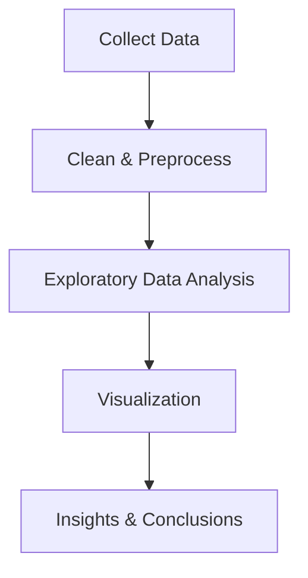

---

# A-short-study-on-Rape-cases-of-India

📊 A data-driven exploration of rape cases in India — analyzing conviction rates, state-wise patterns, and judicial trends over the years.

---

## ⚠️ Important Disclaimer

This project is **for academic and research purposes only**. It does **not intend to sensationalize, trivialize, or exploit** the subject matter. The goal is to provide a **statistical study** to highlight judicial, social, and systemic challenges.
If you are personally affected by these issues, please consider seeking support from trusted organizations and professionals.

---

## 📌 Motivation

* According to **Wikipedia**, experts state that *a woman is victimized every 16 minutes* in India.
* **Conviction rates for rape cases have shown a declining trend:**

  * 44.3% in 1973
  * 37.7% in 1983
  * 26.6% in 2010
* The decline indicates **serious concerns about judicial efficiency and victim justice**.
* **NCRB reports**:

  * *Madhya Pradesh* has the highest **raw number** of reported rape cases.
  * *Delhi* has the highest **per capita rate** of rape cases.

---

## 🏗️ Project Objectives

* Analyze trends in rape case statistics across decades.
* Compare conviction rates and highlight systemic weaknesses.
* Visualize **state-wise case distribution** (absolute vs per capita).
* Provide **data-backed insights** for policymakers, researchers, and students.


## 📊 Methodology



---

## 🔍 Key Insights (Preliminary)

* Conviction rate has **dropped by \~40%** over four decades.
* Some states consistently report **higher raw numbers**, while metro cities show **higher per capita rates**.
* Data points to a **widening gap between reported cases and successful convictions**.

---

## 📈 Example Visuals

*(Place charts/screenshots in an `assets/` folder and reference them here)*

```md
  
  
```

---

## 🛠️ Tech Stack

* **Python** (Pandas, NumPy, Matplotlib, Seaborn, Plotly)
* **Jupyter Notebook** for analysis
* **Tableau / Power BI** *(optional)* for interactive dashboards


## 📌 Project Structure

```
A-short-study-on-Rape-cases-of-India/
├─ data/               # Raw and processed datasets
├─ notebooks/          # Jupyter notebooks for analysis
├─ src/                # Scripts for data cleaning & visualization
├─ assets/             # Charts, graphs, and infographics
├─ requirements.txt
└─ README.md
```

---

## 📢 Ethical Note

* Data is **aggregated and anonymized** — no individual cases are studied.
* Aim: **educational research, not exploitation**.
* Researchers are urged to treat findings with **sensitivity and responsibility**.

---

## 📌 Future Work

* State-wise **time-series analysis**.
* Study correlation between **conviction rates and judicial reforms**.
* Comparative study with other countries’ data.

---

## 📜 License

MIT License – free for academic and research purposes.


